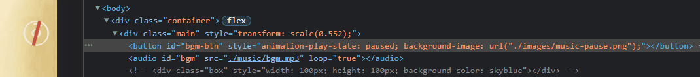

# bgmOperation

中文名：背景音乐操作类

实现背景音乐的播放暂停以及相对应的动画显示。并且能够识别微信浏览内核环境，实现自动播放。

# 使用演示

关键代码：

```html
<!-- html -->
<!DOCTYPE html>
<html lang="zh-cn">
  <head>
    <meta charset="UTF-8" />
    <title>example</title>
    <!-- jweixin 微信JSdk「必需」 -->
    <script src="https://res.wx.qq.com/open/js/jweixin-1.6.0.js" defer="defer"></script>
    <!-- 背景音乐操作类引入 -->
    <script type="module" src="./js/main.js" defer="defer"></script>
  </head>
  <body>
    <div id="container">
      <!-- 互动按钮 -->
      <button id="bgm-btn"></button>
      <!-- 背景音乐控件，audio:src 输入背景音乐的相对路径 -->
      <audio id="bgm" src="./music/bgm.mp3" loop="true"></audio>
    </div>
  </body>
</html>
```

```scss
// scss
#container {
  #bgm,
  #bgm-btn {
    position: absolute;
  }

  #bgm-btn {
    width: 70px; // 根据图片具体宽高逐一设置
    height: 70px;
    background: url(../images/music-pause.png) no-repeat center / cover; // 此处放暂停效果图片
    border: none;
    animation: musicAnimation 6s linear 0s infinite normal;
  }

  @keyframes musicAnimation {
    to {
      transform: rotate(360deg);
    }
  }
}
```

```js
// javascript
new bgmOperation("#bgm-btn", "#bgm", "./images/music-play.png", "./images/music-pause.png"); // 根绝参数说明填写
```

# 效果演示



# 文件说明

- bgmOperation.js 「未压缩版本」包含详细注释，以及两种图片切换方式。
- bgmOperation.min.js 「压缩版本」图片切换方式使用方法一
