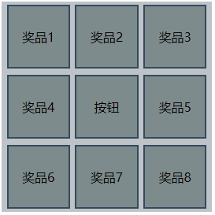
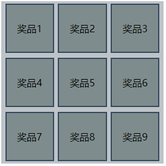

# nineRichLottery

中文名：九宫格抽奖类

实现九宫格抽奖效果，根据指定下标实现精准停止，timing: ease-in，内置 rule，支持自定义动画显示位置以及显示顺序。

# 使用演示

九宫格样式结构代码实现。

主要代码：

```html
<!-- html: 主要框架搭建 -->
<div class="container">
  <div class="box">奖品1</div>
  <div class="box">奖品2</div>
  <div class="box">奖品3</div>
  <div class="box">奖品4</div>
  <div id="btn">按钮</div>
  <div class="box">奖品5</div>
  <div class="box">奖品6</div>
  <div class="box">奖品7</div>
  <div class="box">奖品8</div>
</div>
```

```css
/* css: 样式编写 */
* {
  margin: 0;
  padding: 0;
}
.container {
  display: flex;
  flex-wrap: wrap;
  justify-content: space-evenly;
  align-items: center;
  width: 30vw;
  height: 30vw;
  background-color: #bdc3c7;
}
.container div {
  display: flex;
  justify-content: center;
  align-items: center;
  width: 9vw;
  height: 9vw;
  background-color: #7f8c8d;
  border: 2px solid #34495e;
  box-sizing: border-box;
}
.container #btn {
  cursor: pointer;
}
.container .active {
  background-color: #16a085;
}
```

```js
// nineRichLottery 实例
let l = new nineRichLottery(document.querySelectorAll(".container div"), 0);

// 绑定点击事件，触发 l.init() 函数
document.querySelector("#btn").addEventListener("click", function () {
  l.init();
});
```

# 效果演示

效果一

```javascript
this.rule = [0, 1, 2, 5, 8, 7, 6, 3];
```



效果二

```javascript
this.rule = [0, 1, 2, 3, 5, 6, 7, 8];
```


效果三

```javascript
this.rule = [0, 1, 2, 3, 4, 5, 6, 7, 8, 9];
```



[立即运行](./index.html)

# 文件说明

- bgmOperation.js 「未压缩版本」
- bgmOperation.min.js 「压缩版本」
