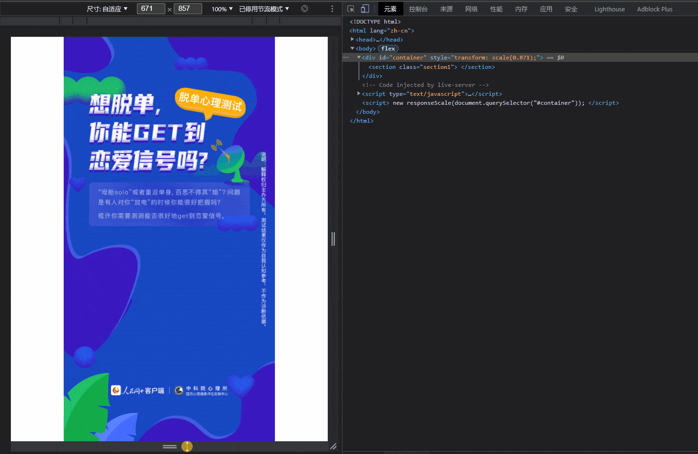

# responseScale

中文名：响应缩放类

根据设计稿的宽高度，自动获取浏览器窗口大小，通过 transform:scale 属性实现缩放响应。

# 使用演示

关键代码：

```html
<!-- html -->
<!DOCTYPE html>
<html lang="zh-cn">
  <head>
    <meta charset="UTF-8" />
    <title>example</title>
    <!-- 响应缩放类引入 -->
    <script src="./responseScale.js"></script>
  </head>
  <body>
    <div id="container">
      <section class="section1"> </section>
    </div>
  </body>
</html>
```

```css
/* css */
* {
  margin: 0;
  padding: 0;
}
body {
  display: flex;
  justify-content: center;
  align-items: center;
  width: 100vw;
  height: 100vh;
  overflow: hidden;
}
#container {
  width: 750px; /* 设计稿宽度 */
  height: 1508px; /* 设计稿高度 */
}
.section1 {
  width: inherit;
  height: inherit;
  background: url(./images/test_bg.jpg) center / cover; /* 设计稿高度 */
}
```

```js
// javascript
new responseScale(document.querySelector("#container")); // 根绝参数说明填写
```

# 效果演示

效果一「根据宽高度选择最小值适应」


效果二「根据宽度适应：常用」


效果三「根据高度适应：常用」



# 文件说明

- bgmOperation.js 「未压缩版本」包含详细注释，以及三种元素缩放方式。
- bgmOperation.min.js 「压缩版本」图片切换方式使用方法一。
